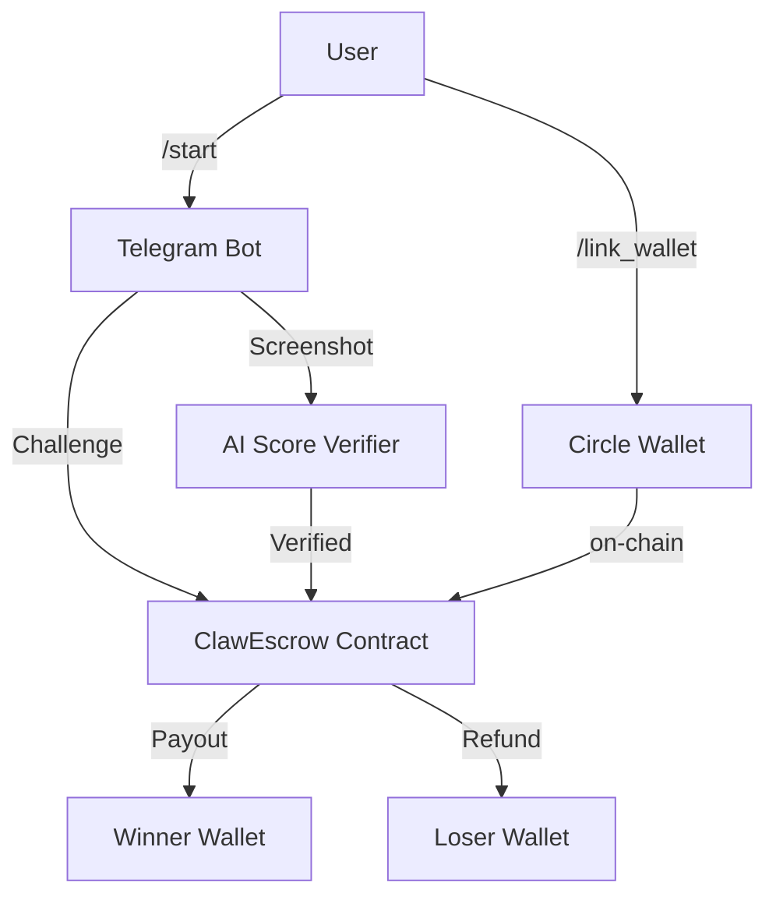

# ClawStation — Web3 Gaming Bot

**Live Bot:** [@ClawStationOfficialBot](https://t.me/ClawStationOfficialBot)
**Web Docs:** [playingsidequest.fun/clawstation](https://playingsidequest.fun/clawstation)

## What is ClawStation?

A **blockchain-powered** 1v1 gaming bot that:
- Creates **on-chain escrow** matches (ClawEscrow on Base)
- Verifies results via **AI vision** (screenshot analysis)
- Auto-pays winners — **no middleman**
- Supports **any country, any platform** — global settlement in USDC

## Quick Start

1. Open [@ClawStationOfficialBot](https://t.me/ClawStationOfficialBot)
2. Send `/start`
3. Tap **[Challenge]** → pick EA FC
4. Set **stake** (USDC: `$5`–`$500`)
5. Tell us **Home** or **Away** (which team/club you're using)
6. Pick **opponent** (public / invite / @username)
7. **Confirm** → stake locks on ClawEscrow
8. Play → send **screenshot** → AI verifies → **auto-payout**

## Architecture



## Key Modules

| Module | File | Purpose |
|--------|------|---------|
| **Bot** | `gaming/src/backend/bot/handlers.py` | All Telegram handlers |
| **AI** | `gaming/src/backend/score_verifier.py` | Screenshot verification |
| **Blockchain** | `gaming/src/backend/blockchain_layer.py` | Web3 + ClawEscrow |
| **Wallet** | `gaming/src/backend/wallet_service.py` | Circle creation |
| **Match** | `gaming/src/backend/match_manager.py` | On-chain match state |
| **Escrow** | `gaming/src/backend/escrow_manager.py` | USDC locks |
| **Court** | `gaming/src/backend/court_layer.py` | Dispute resolution |
| **API** | `gaming/src/backend/api/__init__.py` | FastAPI server |

## User Flow

### Step 1: Wallet Setup
```bash
/link_wallet 0x123...  # Ethereum address for payouts
/link_psn XxSniper    # PSN gamertag (optional)
/link_xbox HaloKing    # Xbox gamertag (optional)
```

### Step 2: Challenge
```bash
/start
→ Main Menu
→ [Challenge]
→ Select EA FC
→ Stake: $25 USDC
→ Home/Away: [pick which side you're playing]
→ Opponent: @username or public
→ Confirm: /match <id>
```

### Step 3: Play & Verify
```bash
# After playing, send screenshot:
/report <match_id> <screenshot_url>
```

The AI verifies:
- ✅ Screenshot matches the claimed game
- ✅ Score is visible
- ✅ PSN/Xbox gamertag matches your profile
- → **Auto-payout** to winner

### Step 4: Get Paid
- **Winner** → USDC released from ClawEscrow
- **Loser** → stake refunded (if AI confirms loss)
- **Expired** → stake returned after 15 min

## Commands

| Command | Args | Description |
|---------|------|-------------|
| `/start` | — | Open bot menu |
| `/challenge` | — | Start challenge flow |
| `/link_psn` | `<gamertag>` | Link PSN |
| `/link_xbox` | `<gamertag>` | Link Xbox |
| `/link_wallet` | `<0xaddr>` | Set payout wallet |
| `/set_country` | `<country>` | Set your region |
| `/balance` | — | Check USDC |
| `/history` | — | View transactions |
| `/profile` | — | View stats |
| `/report` | `<match_id> <url>` | Submit proof |
| `/leaderboard` | — | Top players |

## For Developers

**API Endpoints** (port 8000):
- `GET /health` — bot status
- `POST /api/v1/gaming/stake` — create match
- `POST /api/v1/gaming/report` — submit proof

**Smart Contracts** (Base Sepolia):
- ClawEscrow: `0xFC44a06295d4fC58420027932A6FcB3C13D83859`
- USDC: `0x036CbD53842c5426634e7929541eC2318f3dCF7e`
- Admin: `0xB2CCcac46cE93C2ac27fDBF7248938CC57F29424`

## License

MIT — open source. Fork at [github.com/playingsidequest](https://github.com/playingsidequest)